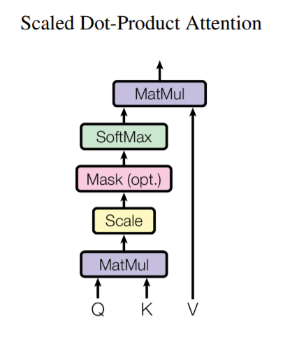
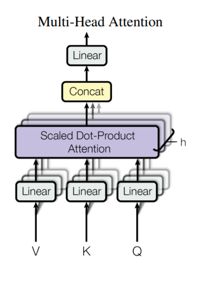
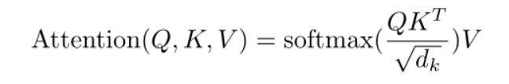

每个markdown文件，就是一个方向的论文的阅读列表，每一项就是一篇论文

example:

第1行：论文标题 作者 发表的地方 年份 pdf链接 引用数

后面：笔记

## 01 Attention Is All You Need /Ashish Vaswani, ... / arXiv / 2017 / https://arxiv.org/pdf/1706.03762.pdf / 33331

1. Transformer 模型架构

2. 注意力机制

   An attention function can be described as mapping **a query** and **a set of key-value  pairs** to an output, where the query, keys, values, and output are all vectors.  The output is computed as a weighted sum of the values, where the weight  assigned to each value is computed by a compatibility function（相似性函数） of the query with  the corresponding key.

3. 本文的注意力机制

   We call our particular attention "Scaled Dot-Product Attention" (Figure 2). The  input consists of queries and keys of dimension $d_k$, and values of dimension $d_v$.  We compute the dot products of the query with all keys, divide each by $\sqrt{d_k}$ , and  apply a softmax function to obtain the weights on the values. In practice, we  compute the attention function on a set of queries simultaneously, packed  together into a matrix $Q$. The keys and values are also packed together into  matrices $K$ and $V$ . We compute the matrix of outputs as:
   
   The two most commonly used attention functions are additive attention [2], and  dot-product (multiplicative) attention. Dot-product attention is identical to  our algorithm, except for the scaling factor of $\frac{1}{\sqrt{d_k}}$ . Additive attention  computes the compatibility function using a feed-forward network with a single  hidden layer. While the two are similar in theoretical complexity, dot-product  attention is much faster and more space-efficient in practice, since it can be  implemented using highly optimized matrix multiplication code.
   
   While for small values of $d_k$ the two mechanisms perform similarly, additive  attention outperforms dot product attention without scaling for larger values of  $d_k$ [3]. We suspect that for large values of $d_k$, the dot products grow large in  magnitude, pushing the softmax function into regions where it has extremely  small gradients. To counteract this effect, we scale the dot products by $\frac{1}{\sqrt{d_k}}$  .

## BERT: Pre-training of Deep Bidirectional Transformers for Language Understanding / Jacob Devlin / arxiv / 2019 / https://arxiv.org/pdf/1810.04805.pdf / 32182

1. 

