### 1. 什么是Git
git是一个软件管理器,有一个中心的服务器控制最新版本代码,每个开发者自己有个本地仓库，在开发过程中先将代码提交到本地仓库再推送到中心服务器上，这样的好处就是每个人都依赖于中心服务器来实现交互，但又不会被中心服务器限制，就算中心服务器挂了，也能很容易的找到最新版本的代码，而且我自己的工作依然可以顺利进行，提交到本地仓库，当中心服务器修复之后，再将自己仓库的东西推送到中心服务器。
### 2. 本地的git仓库
我们要进行开发，提交代码和中心服务器进行交互，首先我们要有一个本地的开发基地，也就是本地的git仓库。拥有本地的git仓库的方式有两种，一就是在自己已有的目录里初始化自己的git仓库然后和中心服务器建立连接，更新最新代码到自己的git仓库。二就是将一个已经存在的项目克隆到自己的目录成为自己的git仓库。

执行git init命令，就会创建并初始化git仓库，这个时候在该目录下会产生一个.git的隐藏文件夹，而该目录就是你的工作目录，你的一切行为都是在这个目录里，而这个.git文件夹就是你的本地仓库，当你进行了一些文件操作之后，认为可以提交了，那么首先就要提交到本地仓库，也就是这个.git中，然后再推送到中心服务器。或者直接克隆一个仓库到本地作为git仓库，也是一样的。当你进入到这个.git目录中，会发现里面还有很多的子目录和文件，有的是很重要的，比如：config文件，这是项目的配置文件，里面有中心服务器的信息和分支信息；HEAD文件指向当前的分支；index文件是暂存区的相关信息；logs目录中都是相关操作产生的日志，这个很重要，因为日志是我们操作的唯一证据，我们本地的版本控制也是靠它；objects目录里面存储的就是所有 的数据，也就是快照；refs目录里面存储指向数据提交对象的指针。
### 3. git的分层结构
&emsp;&emsp;先来看看git的分层结构：

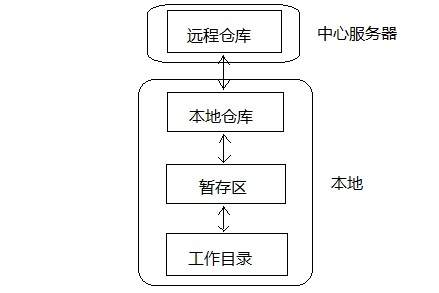

git的工作总共分四层，其中三层是在自己本地的git仓库，包括了工作目录、暂存区和本地仓库，工作目录就是我们执行命令git init时所在的地方，也是我们执行一切文件操作的地方；暂存区和本地仓库都是在.git目录中，因为它们只是用来存数据的。远程仓库在中心服务器中，我们做完工作之后可以将文件推送到远程仓库，或者从远程仓库更新最新的代码到本地的git仓库。git所存储的都是一系列的文件快照，然后跟踪这些文件快照，发现哪个文件快照有变化，它就会提示你需要添加那个文件到暂存区或者提交到本地仓库来保证你的工作目录是干净的。

git中的文件有两种状态，一种是被跟踪的，也就是提交到本地仓库的文件，因为本地仓库要保管它们，当然得跟踪他们，对它们负责；还有一种就是未被跟踪的。当我们添加新的文件时，它不是被跟踪的，因为本地仓库里面没有这个文件，它是外来的，本地仓库目前还不需要对他负责。但是如果是对本地仓库已经存在的文件进行修改，那么这些文件就是被跟踪的文件，就可以通过git status查看他们的状态来进行相应的操作。当然我们也可以生成一个.gitignore文件，里面指定要忽略的文件类型，然后这些文件就不会被跟踪，不管怎么改变它们，git status都不会提示你。

所以当我们在工作目录中进行文件操作后，要先将文件添加到暂存区，然后再将暂存区中刚添加的文件快照提交到本地仓库，然后再将本地仓库的最新版本文件快照推送到远程仓库。这个文件快照其实就是各个文件在被添加到暂存区时的状态，就和照相一样，留下每个时刻的快照，方便以后查询，而git存储的就是这一系列的快照。说到这个快照就要说说git的对象了。
### 4. git的对象
从根本上讲，git是一套内容寻址的文件系统，它存储的是key-value键值对，根据key值来查找value，说到寻址就会想到指针吧，不错，git也是根据指针来寻址的，这些指针就存储在git的对象中。git对象一共有3种，commit对象，tree对象和blob对象。下面便是这3种对象：

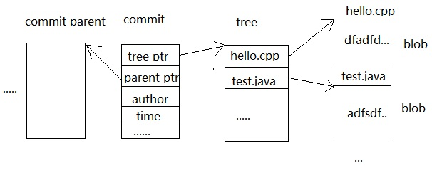

这个blob对象对应的就是文件快照中那些发生变化的文件内容；tree对象记录了文件快照中各个目录和文件的结构关系，它指向了被跟踪的快照；commit对象记录了每次提交到本地仓库的文件快照，从上图看出其中有两个指针，一个指向tree对象，一个则指向上一个commit对象。这个怎么理解呢，怎么还有上一个commit对象？在开发过程中，我们会提交很多次文件快照，那么第一次提交的内容会用一个commit来记录，这个commit没有指针指向上一个commit对象，因为没有上一个commit，它是第一个，当第二次提交时，又会有另外一个commit对象来记录，那么这次commit对象中就会有一个指针指向上一次提交后的commit对象，经过很多次提交后就会有很多的commit对象，它们组成了一个链表，当我们要恢复哪个版本的时候，只要找到这个commit对象就能恢复那个版本的文件。所谓的HEAD对象就指向最近一个提交的commit对象，也就是最后一个commit对象。
### 5. git的基本操作
前面说了这么多东西，也该看看基本操作了，基本操作无非是文件的增删改和版本的提交、更新和回溯。当把上面的内容弄清楚之后，这些基本操作根本就是小菜一碟：

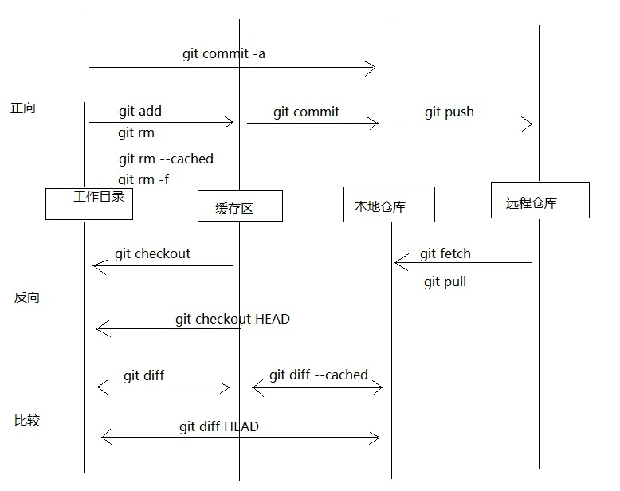

上面列出了一些基本的命令，基本的用法google一下一大堆，这里不用多说。还有就是要经常用到git status这个命令，它可以指引你该干嘛干嘛，确定你的工作目录是否干净。干净的意思就是和暂存区还有本地仓库保持一致。还有一个命令也经常用到的，那就是git log，这个命令会列出你的操作产生的日志，有很多的信息，还有提交后的commit对象的id，这在checkout版本的时候用处很大。
### 6. git的分支是什么
顾名思义，分支就是从主线上分离出来进行另外的操作，而又不影响主线，主线又可以继续干它的事，是不是有点像线程，最后分支做完事后合并到主线上而分支的任务完成可以删掉了。这样是不是很方便，主线继续做它的事，分支用来解决临时需求，二者互不相干。

git的分支功能特别强大，它不需要将所有数据进行复制，只要重新创建一个分支的指针指向你需要从哪里开始创建分支的提交对象(commit)，然后进行修改再提交，那么新分支的指针就会指向你最新提交的这个commit对象，而原来分支的指针则指向你原来开发的位置，当你在哪个分支开发，HEAD就指向那个分支的最新提交对象commt。没弄清楚没关系，先有这么一个概念，后面慢慢就会弄清的。
### 7. 分支的新建与合并
我们可以用命令git branch来查看我们的git仓库有几个分支，前面有个*号的就为我们目前工作所处的分支。我们可以通过命令git branch name来创建分支，而这个分支的指针就指向最新的commit对象，也就和HEAD指向同一个对象。我们可以通过命令git checkout name来切换到目的分支，我们默认的主分支为master。分支的创建和切换，其实就是简单的创建指针和找指针而已，而根据找到的指针找到所指向的commit对象，然后将工作空间恢复成该commit对象所指的文件快照让我们来工作。当提交一次，指针就重新指向这个最新提交的对象，特别的简单。

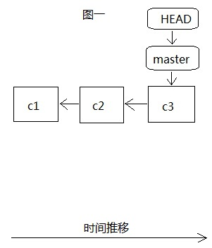 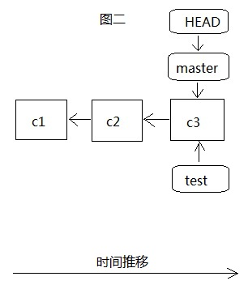

当我们建立分支test之前，只有master一个主分支，如图一，我们所有的开发都是在这个分支上，而且HEAD是指向最近一次提交的commit对象c3，c3以前还有两次提交c1和c2，这时我们通过git branch test创建test分支，如图二，这时HEAD还是指向master分支最近一次提交的c3，当git checkout test切换到test分支后，HEAD就指向test分支的最近一次提交c3，这个时候其实在.git里面都是指向同样一份数据c3。

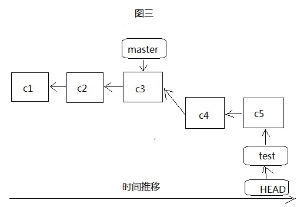

 这个时候，当我们在test分支上进行了几次开发,提交了c4和c5两个版本后，test和HEAD都指向test分支的最近一次提交c5，如图三，而master此时还没有变化，仍然指向的是c3，如果这个时候将test分支合并到master分支，那么git根本不用做什么，只要将master移动，指向c5就可以了，这个过程称之为Fast-forward快进。如果此时test的任务完成，我们就可以通过git branch -d test将它删除掉，继续在主分支master上进行开发。如果是这样的话，那么test分支就白建了。

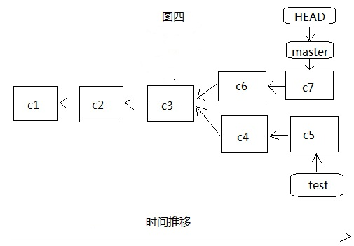

那么如果此时master分支上又进行另外的开发，提交了两个版本c6和c7，那么此时的master和HEAD指针都指向的是c7，如图四，可以看出，在哪个分支上开发，HEAD就指向的是哪个分支上的commit，这个时候合并两个分支的话，就如下。

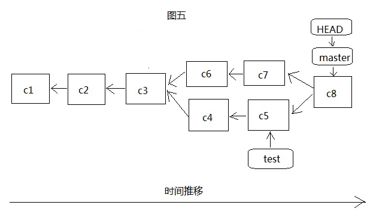

如图五，我们先切换到master分支，然后通过git merge test将test分支合并到master分支，这个时候，git就不是简单的移动指针了，因为两边都有开发，所以git就要对于两个分支的最新提交c5和c7还有两个分支共同的祖先commit对象c3来进行一次简单的三方合并，产生新的文件快照并用新的commit对象c8记录，这个合并的过程不需要太在意，如果产生了冲突，也就是两个分支对同一个文件进行了修改，那么git就会停下合并操作，让你处理好冲突后，再提交(c8)，然后再进行合并。这时master和HEAD都指向c8，但是test是没有移动的，此时还可以在test上继续开发，再合并到master，如果test已经没有利用价值了就可以删掉了。
### 8. 本地分支，追踪分支和远程分支
这里有三个概念，本地分支就是我们可以通过git branch查看到的分支，也就是我们自己git仓库所拥有的分支，我们都可以利用。远程分支是对远程仓库的分支的索引，它其实也是本地分支，只是我们无法移动它，必须要和中心服务器交互，在从服务器更新到本地的代码中移动，远程分支的作用就是我们上次和中心服务器交互更新得到的最新版本，它也是个指针。追踪分支比较难理解，它也是一个本地分支，只是它对应了一个远程分支，如果我们本地的某个分支对应了一个特定的远程分支，那么它就是追踪分支，比如我们最初的master分支就是一个追踪分支，它对应远程分支origin/master，这里origin是远程仓库名，当我们在master分支里执行更新(fetch，pull)或是推送(push)，在不指定分支的情况下，默认就是从origin/master分支更新或者提交到origin/mster分支。

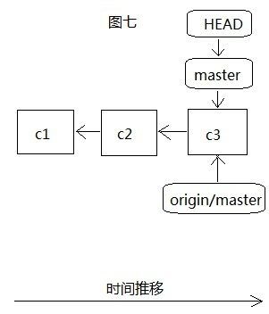 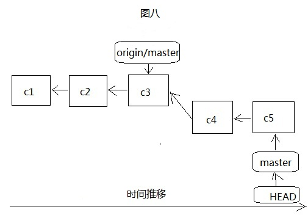

 从图七和图八很容易看出来，和我们本地创建分支很相似，只是origin/master远程分支只有在连接服务器并更新服务器代码到本地后才会移动，如下图九：

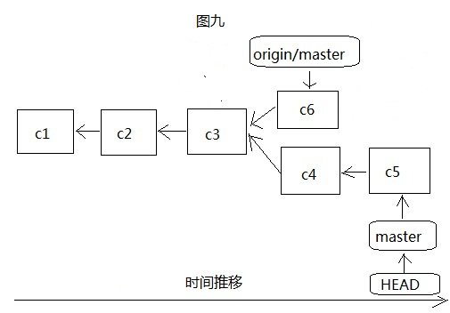

更新远程代码到本地有两个命令，fetch和pull，fetch是将远程代码更新到本地，但是不会执行合并操作，需要自己查看，解决冲突什么的，然后自己再执行merge将更新来的代码合并到我们自己制定的分支，但是pull就将这两个操作合成了一步，直接将服务器代码更新并合并到本地指定分支，当然遇到冲突也必须要自己解决。所以我们一般都使用fetch来实现更新，虽然麻烦了点，但是不容易出问题。

将本地代码推送到远程仓库，也就是中心服务器，一般我们推送数据都是git push origin master:master，这里指定远程仓库名，本地分支名和远端分支，也就是将我们本地master分支的数据推送到远程仓库origin的master分支。如果本地的master分支是追踪分支，那么在不指定的情况下，它会自己找到远程仓库中对应的分支来推送数据。或者我们直接进行git push origin操作，只指定远程仓库名，那么git会根据我们目前所在分支和它所对应的远程仓库的分支来实现数据推送，前提是我们目前所在分支必须是追踪分支。当然如果是git push origin :master，这里本地分支名是空的，这个操作就是将空分支推送到远程仓库的master分支，结果就是将master分支删除。

既然追踪分支这么好用，那么我们怎么建立追踪分支呢，有两种方式，第一种方式是根据远程分支创建追踪分支，如果不指定该追踪分支的名字，默认和远程仓库的分支名字一样：git checkout --track origin/test，这样我们就建立了一个名为test的追踪分支，如果重新指定追踪分支的名字：git checkout -b name origin/test，这样我们就创建了一个名为name的追踪分支，它对应远程仓库的test分支。第二种方式是已经存在某个本地分支，要让它来对应某个远程分支来成为追踪分支，也有两个命令可以用，git branch --set-upstream test origin/test 或者git branch -f --track test origin/test 这里我们就让我们本地已经存在的test分支来追踪远程的test分支。
### 9. git分支管理
git创建分支与合并分支是如此简单快捷，那么在我们的开发过程中可以疯狂的使用分支，而且git的核心玩法之一就是分支，非常提倡使用分支，但是是不是我们可以肆无忌惮的使用分支呢，创建这么多的分支我们要如何来管理呢，分支不在多而在恰到好处，如果分支创建多了，管理起来就麻烦了，所以推荐一种分支的管理策略，git-flow，同时推荐一篇文章来了解这种策略：http://nvie.com/posts/a-successful-git-branching-model/，让你的git使用更加顺手。